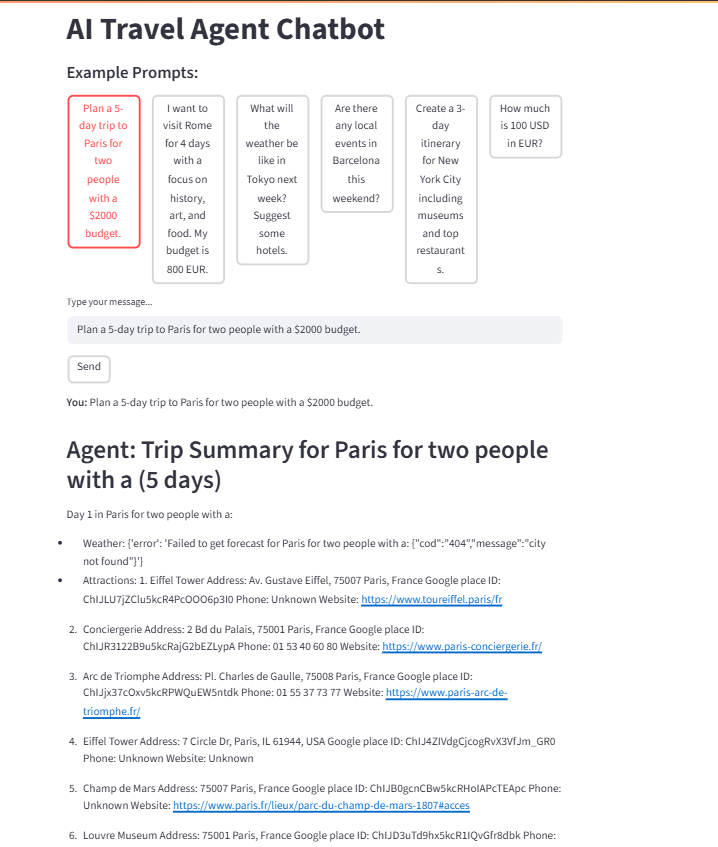

# AI Travel Agent

This project demonstrates two approaches to building an AI-powered travel planning assistant:
- A **fixed workflow** (hardcoded pipeline)
- A **flexible ReAct agent** (dynamic, LLM-driven tool use)

## Project Structure

- `AI_Travel_Agent_Starter.ipynb` — Notebook with a fixed, hardcoded workflow
- `AI_Travel_Agent_ReAct.ipynb` — Notebook with a flexible ReAct agent
- `requirements.txt` — Python dependencies

## Setup Instructions

1. **Clone the repository:**
   ```bash
   git clone https://github.com/srini118us/AgenticAI.git
   cd AgenticAI/AI-Travel-Agent
   ```
2. **Create and activate a virtual environment:**
   ```bash
   python -m venv venv
   # On Windows (PowerShell):
   venv\Scripts\Activate.ps1
   # On Mac/Linux:
   source venv/bin/activate
   ```
3. **Install dependencies:**
   ```bash
   pip install -r requirements.txt
   ```
4. **Set up your `.env` file** with your API keys (see sample in the repo).

## How to Run

- **Streamlit App:**
  ```bash
  streamlit run main.py
  ```
- **Jupyter Notebooks:**
  - Open `AI_Travel_Agent_Starter.ipynb` or `AI_Travel_Agent_ReAct.ipynb` in Jupyter or VS Code and run the cells.

## Approaches: Fixed Workflow vs. ReAct Agent

| Feature/Aspect         | Fixed Workflow (`AI_Travel_Agent_Starter.ipynb`) | Flexible ReAct Agent (`AI_Travel_Agent_ReAct.ipynb`) |
|------------------------|--------------------------------------------------|------------------------------------------------------|
| Workflow type          | Hardcoded, fixed sequence                        | Dynamic, agentic, LLM-driven                         |
| Tool/step selection    | Predefined order                                 | Chosen by agent at runtime                           |
| Flexibility            | Low                                              | High                                                 |
| User prompt            | Parameterized                                    | Free-form, conversational                            |
| Use case               | Pipelines, reproducibility                       | Conversational AI, flexibility                       |
| Visualization          | Static workflow graph (LangGraph, Mermaid)       | No fixed graph, but can log steps                    |

### Example: Fixed Workflow
```python
result = plan_trip("Rome", 4, 800)
print(result)
```

### Example: ReAct Agent
```python
prompt = """
I want to visit Rome for 4 days with a focus on history, art, and food.\nMy budget is 800 EUR. Please provide weather, attractions, hotels, and a daily itinerary.
"""
response = agent.invoke({"input": prompt})
print(response)
```

## Example Prompts
- "Plan a 3-day trip to Paris for two people with a $1000 budget. Include weather, top attractions, hotel suggestions, and a daily itinerary."
- "I want to visit Rome for 4 days with a focus on history, art, and food. My budget is 800 EUR. Please provide weather, attractions, hotels, and a daily itinerary."

## Workflow Visualization
- The fixed workflow notebook uses LangGraph and Mermaid to visualize the pipeline.
- The ReAct agent does not have a fixed workflow graph; instead, you can see the agent's reasoning and tool usage in the verbose output.

## Notes
- Make sure your API keys are set up in your `.env` file.
- The project is modular and easy to extend with new tools or features.
- For any issues, please open an issue or contact the maintainer.

## Sample User Prompt

```
I want to visit Rome for 4 days with a focus on history, art, and food.
My budget is 800 EUR. Please provide:
- Weather forecast
- Must-see historical sites and museums
- Best local restaurants for Italian cuisine
- Hotel options near major attractions
- A day-by-day itinerary
- Estimated daily and total costs in EUR
- Tips for getting around the city
- Present the summary in a clear, organized format.
```

---

### Fixed Workflow Output (Summary)

- **City:** Rome
- **Days:** 3
- **Budget:** mid-range
- **Currency:** EUR
- **Weather:**  
  - 2025-06-25 15:00:00: 31.91°C, clear sky
- **Attractions:**  
  - Roman Forum, Trevi Fountain, Pantheon, Piazza del Popolo, Le Domus Romane di Palazzo Valentini, Spanish Steps, Colosseum, Domus Aurea, Baths of Caracalla, Capitoline Museums, ...
- **Tips for Getting Around:**  
  - Not included in this output.
- **Fallback Used:** No

---

### ReAct Agent Output (Summary)

- **City:** Rome
- **Days:** 3
- **Budget:** mid-range
- **Weather:**  
  - 2025-06-20 15:00:00: 22.14°C, broken clouds  
  - 2025-06-20 18:00:00: 24.74°C, scattered clouds  
  - 2025-06-20 21:00:00: 30.3°C, clear sky  
  - ... (hourly forecasts for 3 days)
- **Attractions:**  
  - Roman Forum, Trevi Fountain, Pantheon, Piazza del Popolo, Le Domus Romane di Palazzo Valentini, Spanish Steps, Colosseum, Domus Aurea, Baths of Caracalla, Capitoline Museums, ...
- **Hotels:**  
  - Napoleon Hotel Roma, Salotto Monti, Otivm Hotel, Hotel Artemide, Hotel Cortina Rome, ...
- **Itinerary:**  
  - Day-by-day plan with attractions (see full output for details)
- **Total Cost:** Not calculated (null)
- **Daily Budget:** Not calculated (null)
- **Tips for Getting Around:**  
  - Not included in this output (consider adding logic for this in your agent).
- **Attractions Fallback Used:** No
- **Hotels Fallback Used:** No

---

### Key Differences

| Feature                | Fixed Workflow         | ReAct Agent           |
|------------------------|-----------------------|-----------------------|
| Weather                | Daily summary         | Hourly forecast       |
| Attractions            | Detailed list         | Detailed list         |
| Hotels                 | Not shown             | Detailed list         |
| Itinerary              | Not shown             | Included              |
| Cost Estimates         | Not shown             | Null (needs logic)    |
| Tips for Getting Around| Not shown             | Not shown             |
| Fallback Used          | No                    | No                    |

---

## 🏁 Main Entry Point: `main.py`

The `main.py` script is the main entry point for this project. It can be run as a Streamlit web application, providing a modern chat interface in your browser for AI-powered travel planning.

- **Streamlit Web App:**  
  Launch with:
  ```bash
  streamlit run main.py
  ```
  - Enter your travel requests in the chat interface
  - Try example prompts for quick testing
  - Get concise, structured trip summaries powered by a flexible ReAct agent

**Sample Output (Web UI):**
```
🌍 TRIP TO PARIS (3 days)
Day 1:
  Weather: Not available
  Attractions: Eiffel Tower, Louvre Museum
  Restaurant: Le Gourmet

💰 TOTAL ESTIMATED COST: $2000
```
*The app enforces concise output, showing only the most relevant details for each day.*



*Example: The Streamlit web app features clickable example prompts, a chat interface for entering travel requests, and displays detailed trip summaries in response to user queries.* 