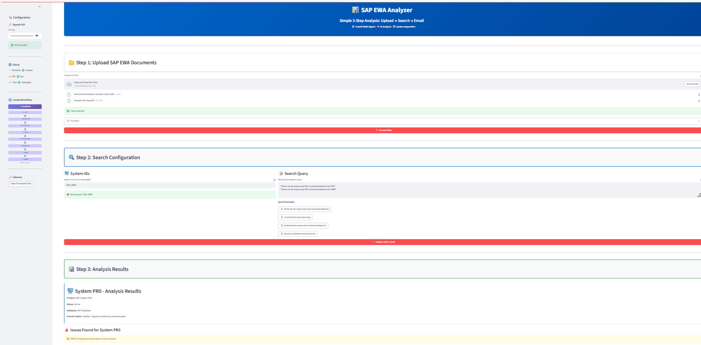

# SAP EWA Analyzer (CrewAI)



## Table of Contents
- [Overview](#overview)
- [Features](#features)
- [Main Files](#main-files)
- [Setup & Installation](#setup--installation)
- [Usage](#usage)
- [Streamlit UI Example](#streamlit-ui-example)
- [Project Structure](#project-structure)
- [Credits](#credits)

---

## Overview

**SAP EWA Analyzer** is a user-friendly, multi-agent application built with CrewAI and Streamlit. It enables users to upload SAP Early Watch Alert (EWA) PDF reports, analyze them using AI, and receive actionable recommendations and email notifications. The app is designed for SAP administrators and consultants to streamline EWA analysis and reporting.

---

## Features
- 📁 **Upload SAP EWA PDFs**
- 🔍 **AI-powered Search & Analysis**
- 🖥️ **System-specific Results & Recommendations**
- 📧 **Email Results (Gmail/Outlook support)**
- 🧹 **Easy Cleanup & Session Management**
- 🧠 **CrewAI Multi-Agent Workflow**
- 🖼️ **Beautiful, Intuitive Streamlit UI**

---

## Main Files

| File                      | Purpose                                                      |
|--------------------------|--------------------------------------------------------------|
| `agents.py`              | Defines CrewAI agents and analysis logic                     |
| `config.py`              | Handles configuration, environment variables, and API keys   |
| `tools.py`               | Utility tools for PDF processing, vector search, etc.        |
| `simple_sap_ewa_app.py`  | Main Streamlit app (UI, workflow, and integration)           |

---

## Setup & Installation

1. **Clone the repository:**
   ```bash
   git clone https://github.com/srini118us/AgenticAI.git
   cd AgenticAI/SAP_EWA_Analyzer_CrewAI
   ```

2. **Install dependencies:**
   ```bash
   pip install -r requirements.txt
   ```

3. **Configure environment variables:**
   - Copy `.env.example` to `.env` and fill in your OpenAI API key and email settings.

4. **Run the Streamlit app:**
   ```bash
   streamlit run simple_sap_ewa_app.py
   ```

---

## Usage

1. **Upload SAP EWA PDF files** using the sidebar or main area.
2. **Enter System IDs** and your **search query** (or use quick examples).
3. **Analyze** the reports and view system-specific results and recommendations.
4. **Send results via email** (Gmail/Outlook supported, configure in `.env`).
5. **Cleanup** processed files and reset the session as needed.

---

## Streamlit UI Example

Below is a screenshot of the SAP EWA Analyzer UI:


---

## Project Structure

```
SAP_EWA_Analyzer_CrewAI/
├── agents.py                # CrewAI agent definitions and analysis logic
├── config.py                # Configuration and environment variable management
├── tools.py                 # Utility tools for PDF, search, and analysis
├── simple_sap_ewa_app.py    # Main Streamlit application
├── requirements.txt         # Python dependencies
├── README.md                # Project documentation
└── ...                      # Other supporting files and tests
```

---

## Credits
- Developed by [srini118us](https://github.com/srini118us)
- Powered by [CrewAI](https://github.com/joaomdmoura/crewAI), [Streamlit](https://streamlit.io/), and OpenAI

---

## License
This project is licensed under the MIT License. 