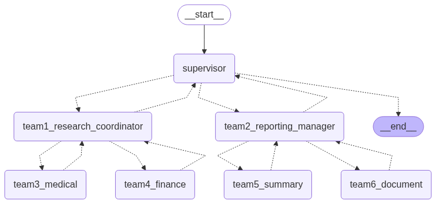

# Hierarchical Agentic System (LangGraph)

## Project Overview
A hierarchical multi-agent system for automated research and report generation using LangGraph and OpenAI. The system coordinates multiple specialized agents to research, summarize, and generate professional documents on complex topics.

## Visual Workflow Graph



*Figure: Workflow graph generated by LangGraph, showing the hierarchy and flow between agents in the system.*

## GitHub Repository
- **Repository:** https://github.com/srini118us/AgenticAI
- **Project Folder:** `hierarchical-agent-framework/`

## Quick Start
1. Clone the repository:
   ```bash
   git clone https://github.com/srini118us/AgenticAI.git
   cd AgenticAI/hierarchical-agent-framework/
   ```
2. Install dependencies:
   ```bash
   pip install -r requirements.txt
   ```
3. Set your OpenAI API key in a `.env` file:
   ```bash
   echo "OPENAI_API_KEY=sk-your-api-key-here" > .env
   ```
4. Run the notebook:
   ```bash
   jupyter notebook hierarchical_agents.ipynb
   ```

## Extensibility
- Add new agents or tools by extending the workflow in the notebook.
- Customize agent logic for different research/reporting tasks. 