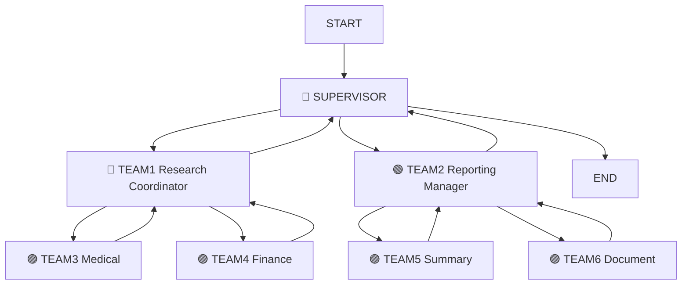

# Hierarchical Agentic System with LangGraph

A sophisticated multi-agent system implementing a hierarchical architecture for automated research and report generation using LangGraph and OpenAI.

## 🎯 Project Overview

This project implements a hierarchical multi-agent system that can automatically research, analyze, and generate comprehensive reports on complex topics. The system demonstrates advanced agent coordination patterns using LangGraph's state management and routing capabilities.

### Assignment Task
**"Write a report on AI impact in healthcare and finance"**

## 🏗️ System Architecture

```
🔷 SUPERVISOR (Top-Level Agent)
├── 🔵 TEAM1 → General Research Coordinator
│   ├── 🟣 TEAM3 → Medical/Pharma Domain Research
│   └── 🟣 TEAM4 → Finance Domain Research
└── 🟢 TEAM2 → Reporting Manager Agent
    ├── 🟣 TEAM5 → Summary Generator
    └── 🟣 TEAM6 → Document Formatter/Exporter
```

### Agent Responsibilities

| Agent | Role | Responsibilities |
|-------|------|------------------|
| **🔷 Supervisor** | Central Orchestrator | • Receives user objectives<br>• Delegates to coordinators<br>• Manages workflow completion |
| **🔵 TEAM1** | Research Coordinator | • Manages domain-specific research<br>• Coordinates TEAM3 & TEAM4<br>• Aggregates research findings |
| **🟢 TEAM2** | Reporting Manager | • Manages report generation<br>• Coordinates TEAM5 & TEAM6<br>• Ensures output quality |
| **🟣 TEAM3** | Medical Specialist | • PubMed research<br>• Healthcare AI analysis<br>• Medical domain expertise |
| **🟣 TEAM4** | Finance Specialist | • Financial API research<br>• Economic data analysis<br>• Fintech domain expertise |
| **🟣 TEAM5** | Summary Generator | • LLM-based summarization<br>• Cross-domain synthesis<br>• Executive insights |
| **🟣 TEAM6** | Document Creator | • PDF/DOCX generation<br>• Professional formatting<br>• Export management |

## 📊 Workflow Execution Flow

### High-Level Flow


### Detailed Graph Visualization

The actual LangGraph workflow generates a detailed visual representation. When you run the system, you'll see output similar to:


**To view the actual graph:**
1. Execute Block 15 in the Jupyter notebook
2. The system will display the interactive graph visualization
3. Alternatively, copy the generated mermaid code to [mermaid.live](https://mermaid.live)

### Execution Sequence

```
Step 1:  START → 🔷 SUPERVISOR
Step 2:  🔷 SUPERVISOR → 🔵 TEAM1 (Research Coordinator)
Step 3:  🔵 TEAM1 → 🟣 TEAM3 (Medical Research)
Step 4:  🟣 TEAM3 → 🔵 TEAM1 (Return with results)
Step 5:  🔵 TEAM1 → 🟣 TEAM4 (Finance Research)
Step 6:  🟣 TEAM4 → 🔵 TEAM1 (Return with results)
Step 7:  🔵 TEAM1 → 🔷 SUPERVISOR (Research complete)
Step 8:  🔷 SUPERVISOR → 🟢 TEAM2 (Reporting Manager)
Step 9:  🟢 TEAM2 → 🟣 TEAM5 (Summary Generation)
Step 10: 🟣 TEAM5 → 🟢 TEAM2 (Return with summary)
Step 11: 🟢 TEAM2 → 🟣 TEAM6 (Document Creation)
Step 12: 🟣 TEAM6 → 🟢 TEAM2 (Return with document)
Step 13: 🟢 TEAM2 → 🔷 SUPERVISOR (Reporting complete)
Step 14: 🔷 SUPERVISOR → END (Workflow finished)
```

## 🚀 Quick Start

### Prerequisites

```bash
pip install langgraph langchain langchain-openai langchain-community python-dotenv
```

### Environment Setup

1. **Set OpenAI API Key:**
   ```bash
   # Method 1: Environment variable
   export OPENAI_API_KEY="sk-your-api-key-here"
   
   # Method 2: .env file
   echo "OPENAI_API_KEY=sk-your-api-key-here" > .env
   
   # Method 3: Direct in code
   os.environ["OPENAI_API_KEY"] = "sk-your-api-key-here"
   ```

2. **Run the Jupyter Notebook:**
   ```bash
   jupyter notebook hierarchical_agents.ipynb
   ```

3. **Execute blocks sequentially** (Blocks 1-16)

## 🛠️ Technical Implementation

### Key Technologies
- **LangGraph**: Workflow orchestration and state management
- **OpenAI GPT-4o-mini**: Language model for all agents
- **Python**: Core implementation language
- **Jupyter Notebooks**: Interactive development environment

### Design Patterns
- **Command Pattern**: Type-safe routing with `Command[Literal[...]]`
- **State Management**: Extended `MessagesState` for complex workflows
- **Tool Integration**: Specialized tools for each domain
- **Error Handling**: Graceful fallbacks for agent failures

### Code Structure
```
📁 Project/
├── 📓 hierarchical_agents.ipynb    # Main implementation
├── 📄 README.md                    # This file
├── 📄 .env                         # Environment variables
└── 📁 outputs/                     # Generated reports
```

## 🔧 Configuration

### Agent Configuration
```python
# LLM Configuration
llm = ChatOpenAI(
    model="gpt-4o-mini",
    temperature=0.1,
    api_key=openai_api_key
)

# State Schema
class State(MessagesState):
    next: str
    user_objective: str
    team3_medical_results: str
    team4_finance_results: str
    team5_summary_results: str
    team6_document_results: str
    research_phase_complete: bool
    reporting_phase_complete: bool
```

### Router Schemas
```python
class SupervisorRouter(TypedDict):
    next: Literal['team1_research_coordinator', 'team2_reporting_manager', 'FINISH']

class Team1Router(TypedDict):
    next: Literal['team3_medical', 'team4_finance', 'supervisor']

class Team2Router(TypedDict):
    next: Literal['team5_summary', 'team6_document', 'supervisor']
```

## 📈 Sample Output

### Research Results
- **Medical Research**: AI diagnostic accuracy improvements, healthcare cost reductions, telemedicine adoption rates
- **Financial Research**: Fintech innovations, algorithmic trading impacts, risk management improvements
- **Executive Summary**: Cross-sector analysis with strategic recommendations
- **Final Document**: Professional PDF/DOCX report with comprehensive findings

## 🎓 Educational Value

### Learning Objectives
1. **Hierarchical Agent Design**: Multi-level coordination patterns
2. **LangGraph Mastery**: State management and workflow orchestration
3. **Tool Integration**: Domain-specific agent capabilities
4. **Error Handling**: Robust agent system design

### Class Pattern Alignment
- Follows established patterns from coursework
- Uses `Command`, `create_react_agent`, `MessagesState`
- Implements structured outputs for decision making
- Demonstrates real-world agent coordination

## 🔍 Troubleshooting

### Common Issues

1. **API Key Not Found**
   ```
   ❌ OpenAI API Key not found!
   ```
   **Solution**: Set your API key using one of the methods in Environment Setup

2. **Import Errors**
   ```
   ImportError: No module named 'langgraph'
   ```
   **Solution**: Install dependencies with `pip install langgraph langchain langchain-openai`

3. **Command Import Error**
   ```
   ImportError: cannot import name 'Command' from 'langgraph.graph'
   ```
   **Solution**: Use `from langgraph.types import Command` (newer LangGraph versions)

4. **Graph Visualization Issues**
   ```
   ⚠️ Graph visualization error
   ```
   **Solution**: Install IPython with `pip install ipython` or use mermaid.live for visualization

## 🚀 Advanced Features

### Extensibility
- **Custom Agents**: Add new specialized agents
- **Tool Integration**: Connect to real APIs (PubMed, financial data)
- **Parallel Execution**: Configure concurrent agent execution
- **Error Recovery**: Implement retry mechanisms

### Production Enhancements
- **Logging**: Comprehensive execution logging
- **Monitoring**: Agent performance tracking
- **Caching**: Result caching for efficiency
- **Authentication**: Secure API access management

## 📚 References

- [LangGraph Documentation](https://langchain-ai.github.io/langgraph/)
- [OpenAI API Documentation](https://platform.openai.com/docs/)
- [Multi-Agent System Patterns](https://www.langchain.com/langgraph)

## 👥 Contributors

- **Student**: Implementation and documentation
- **Course**: Advanced AI Agent Systems
- **Assignment**: Hierarchical Multi-Agent Systems with LangGraph

## 📄 License

This project is created for educational purposes as part of coursework in Advanced AI Agent Systems.

---

## 🎉 Success Metrics

✅ **Assignment Requirements Met:**
- ✅ Hierarchical structure implemented (Supervisor → Coordinators → Workers)
- ✅ All teams functional (TEAM1-6)
- ✅ Domain-specific research capabilities
- ✅ Report generation and document creation
- ✅ LangGraph workflow orchestration
- ✅ Class pattern compliance
- ✅ Step-by-step Jupyter implementation

**Ready for submission and further development! 🚀**