# SAP EWA LangGraph Workflow

Generated: 2025-07-08 17:21:16

## Workflow Diagram

```mermaid

    graph TD
        %% Input Layer
        A[📄 PDF Upload<br/>SAP EWA Reports] --> B[🔧 PDF Processor Agent<br/>Text Extraction]
        
        %% Processing Chain
        B --> C[🧠 Embedding Agent<br/>OpenAI Embeddings]
        C --> D[💾 Vector Store Manager<br/>ChromaDB Storage]
        D --> E{🔄 Query Available?<br/>User Search Input}
        
        %% LangGraph State Management
        D --> F[📊 LangGraph State<br/>WorkflowState Management]
        F -.-> G[🎯 StateGraph Engine<br/>Workflow Orchestration]
        G -.-> H[🔀 Conditional Routing<br/>Decision Logic]
        
        %% Search Flow
        E -->|YES| I[🔍 Search Agent<br/>Vector Similarity Search]
        I --> J[📝 Summary Agent<br/>GPT-4 Analysis]
        J --> K[🖥️ System Output Agent<br/>SAP System Analysis]
        
        %% Email Decision
        K --> L{📧 Email Enabled?<br/>Auto Send Check}
        L -->|YES| M[📬 Email Agent<br/>Gmail SMTP]
        M --> N[✅ Complete Workflow<br/>Results Ready]
        
        %% Alternative Paths
        E -->|NO| N
        L -->|NO| N
        
        %% User Interface
        O[👤 Streamlit UI<br/>User Interface] --> I
        O --> P[⚙️ System Selection<br/>SAP System IDs]
        P --> I
        
        %% Styling
        classDef inputStyle fill:#E8F5E8,stroke:#4CAF50,stroke-width:2px,color:#000
        classDef processStyle fill:#FFF8E1,stroke:#FF9800,stroke-width:2px,color:#000
        classDef decisionStyle fill:#F3E5F5,stroke:#9C27B0,stroke-width:2px,color:#000
        classDef outputStyle fill:#E3F2FD,stroke:#2196F3,stroke-width:2px,color:#000
        classDef emailStyle fill:#FFEBEE,stroke:#F44336,stroke-width:2px,color:#000
        classDef langgraphStyle fill:#1976D2,stroke:#0D47A1,stroke-width:3px,color:#fff
        
        %% Apply Styles
        class A,O,P inputStyle
        class B,C,D,I,J,K processStyle
        class E,L decisionStyle
        class N outputStyle
        class M emailStyle
        class F,G,H langgraphStyle
    
```

## Workflow Description

This diagram shows the complete LangGraph workflow for the SAP Early Watch Analyzer:

### 🔄 **LangGraph Components:**
- **StateGraph Engine**: Orchestrates the entire workflow
- **WorkflowState Management**: Maintains state between agents
- **Conditional Routing**: Makes decisions based on workflow state

### 📊 **Processing Agents:**
1. **PDF Processor Agent**: Extracts text from SAP EWA PDFs
2. **Embedding Agent**: Creates OpenAI embeddings from text
3. **Vector Store Manager**: Stores embeddings in ChromaDB
4. **Search Agent**: Performs vector similarity search
5. **Summary Agent**: Uses GPT-4 for intelligent analysis
6. **System Output Agent**: Analyzes SAP-specific systems
7. **Email Agent**: Sends results via Gmail SMTP

### 🎯 **Key Features:**
- Interactive Streamlit UI
- SAP system selection
- Conditional email notifications
- State management with LangGraph
- Vector search capabilities

### 🛠 **Technical Stack:**
- **LangGraph**: Workflow orchestration
- **OpenAI GPT-4**: Language model
- **ChromaDB**: Vector database
- **Streamlit**: User interface
- **Gmail SMTP**: Email integration
