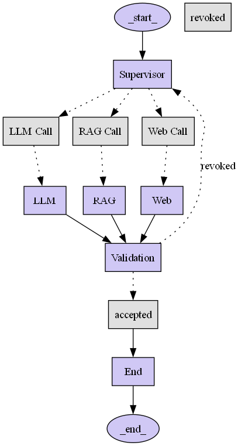

# Stateful Agents Lab

This directory contains a set of examples demonstrating the implementation of stateful agents for various AI tasks.

## Table of Contents

- [Project Overview](#project-overview)
- [Setup](#setup)
- [Workflow Visualization](#workflow-visualization)
- [Running Examples](#running-examples)
- [Key Files](#key-files)

## Project Overview

This project explores the concept of stateful agents, where agents can maintain and update their internal state based on interactions and observations. The examples provided here demonstrate different capabilities of these agents, including:

-   **LLM Integration**: Agents interacting with Large Language Models.
-   **RAG (Retrieval Augmented Generation)**: Agents leveraging external knowledge bases.
-   **Web Scraping**: Agents designed to extract information from the web.
-   **Validation**: Agents responsible for validating information or decisions.
-   **Orchestration**: A supervisor agent managing the overall workflow.

## Setup

To run the examples in this lab, you need to set up your Python environment and install the necessary dependencies.

1.  **Navigate to the directory**:
    ```bash
    cd stateful-agents-lab
    ```

2.  **Create .env file**:
    Create a `.env` file in the project root with your OpenAI API key:
    ```
    OPENAI_API_KEY=your_api_key_here
    ```

3.  **Install dependencies**:
    It is recommended to use a virtual environment.
    ```bash
    pip install -r requirements.txt
    ```

3.  **Install Graphviz**:
    Graphviz is required to visualize the agent workflows. Download and install it from the official [Graphviz website](https://graphviz.org/download/) or using your system\'s package manager. Ensure the `dot` command is available in your system\'s PATH.

## Workflow Visualization

The `graph_workflow.py` script generates a visual representation of the stateful agent system\'s high-level flow.

To generate the workflow graph (`stateful_agent_workflow.png`):

```bash
python graph_workflow.py
```

After running, the `stateful_agent_workflow.png` file will be created in this directory.

```
Workflow graph 'stateful_agent_workflow.png' generated successfully!
```


## Running Examples

To run the main stateful agent workflow, execute the `main.py` script:

```bash
python main.py
```

### Example Output

When you run `main.py`, you will see output similar to the following, demonstrating the interaction of different agents:

```
--- Starting Simple Workflow for Task: llm_query ---
Final Validated Output: Sure! Quantum computing is a type of computing that uses principles from quantum mechanics, a branch of physics that deals with how very small things like atoms and particles behave. Traditional computers use bits to store and process information, but quantum computers use quantum bits, or qubits, which can exist in multiple states at the same time due to a property called superposition.

This allows quantum computers to process a vast amount of information simultaneously and solve certain problems much faster than classical computers. Quantum computing has the potential to revolutionize fields like cryptography, drug discovery, and artificial intelligence by tackling complex problems that are currently impossible or time-consuming for classical computers to solve.

--- Starting Simple Workflow for Task: rag_query ---
Final Validated Output: Based on the provided context from the source "stateful-agents-lab/attention.pdf" on Page 3, the key concepts of attention mechanisms in the context of multi-head attention and scaled dot product attention are outlined. Here is a comprehensive summary:

1. **Additive Attention vs. Dot Product Multiplicative Attention**:
   - **Additive Attention**: It computes a compatibility function using a feed-forward network with a single hidden layer. It has similar theoretical complexity to dot product attention but can be slower in practice.
   - **Dot Product Multiplicative Attention**: It uses dot product attention, employing a scaling factor of 1/√dk to scale the dot products. This scaling factor is crucial for managing the magnitude of dot products and gradients during the softmax operation.

2. **Scaled Dot Product Attention**:
   - In scaled dot product attention, the query and keys are divided by √dk (where dk represents the dimensionality of the keys) before applying the softmax function to obtain attention weights towards the values. This method helps regulate the impact of dot products on the softmax function gradients.

3. **Multi-Head Attention**:
   - **Linear Projection**: Instead of performing a single attention function on keys, values, and queries, multi-head attention linearly projects these elements h times into different learned linear projections—each with reduced dimensions (dk/dv). This allows for parallel computation and facilitates learning from various representation subspaces.
   - **Parallel Computation**: By running attention layers in parallel on packed matrices of queries, keys, and values, multi-head attention can jointly capture information from different positions and representation subspaces efficiently.

4. **Benefits of Multi-Head Attention**:
   - **Enhanced Attention**: Multi-head attention enables models to focus on different aspects of the input simultaneously, preventing averaging effects seen with single attention heads.
   - **Comprehensive Information Extraction**: The combination of multiple attention heads facilitates a more comprehensive extraction of information across different dimensions and positions in the data.

Given the detailed information from the source, these are the key concepts of attention mechanisms discussed in the provided context.

--- Starting Simple Workflow for Task: web_scrape ---
Final Validated Output:
        Recent AI advancements include:
        -   **Large Language Models (LLMs)**: Continued improvements in models like GPT-4, Gemini, and Claude, with larger contexts, better reasoning, and multimodal capabilities.
        -   **Generative AI for Media**: Breakthroughs in image, video, and music generation (e.g., Midjourney, Stable Diffusion, Sora).
        -   **AI in Scientific Discovery**: Accelerating research in drug discovery, material science, and climate modeling.
        -   **Edge AI**: More powerful AI models running directly on devices, enabling real-time processing and enhanced privacy.
        -   **Ethical AI and Regulation**: Growing focus on AI safety, fairness, and the development of regulatory frameworks globally.

## Key Files

-   `main.py`: The main entry point for running the stateful agent workflow.
-   `graph_workflow.py`: Generates the visual workflow graph.
-   `llm.py`: Contains the logic for LLM interactions.
-   `rag.py`: Implements Retrieval Augmented Generation capabilities and includes example usage.
-   `web_scraper.py`: Handles web scraping functionalities.
-   `validator.py`: Contains validation logic.
-   `stateful_agent_workflow.png`: The generated workflow visualization.
-   `requirements.txt`: Lists all Python dependencies. 